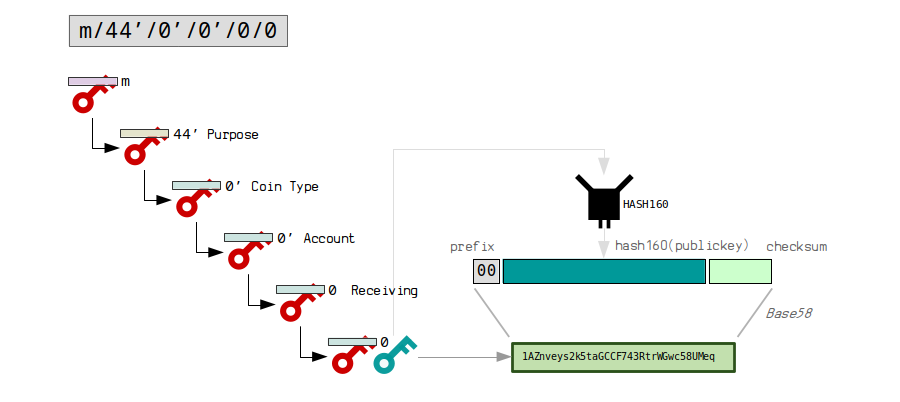

## Mnemonic Phrase Generation

### Source

 * [Ethereum 201: HD Wallets](https://wolovim.medium.com/ethereum-201-hd-wallets-11d0c93c87f7)
 * [Bip 32](https://learnmeabitcoin.com/technical/extended-keys)
 * [Bip 44](https://learnmeabitcoin.com/technical/derivation-paths)

Bip 32 is simply about private keys and public keys that you can derive children from. Your first extended keys (master keys) are created by putting a seed through the HMAC-SHA512 hash function. This allows you to create a tree of extended keys, with each key having its own unique derivation path from the master key.

Bip 44 is a formal definition to help with compatibility between wallets, we have a set structure for how we derive keys for use in a hierarchical deterministic wallet.

For Bitcoin-like coins (with change and multiple addresses):

`m / purpose' / coin_type' / account' / change / address_index`

`BIP 44: m/44'/0'/0'/0/0` [bitcoin]

For Ethereum-like coins (with single account addresses):

`m / purpose' / coin_type' / account'`

`BIP 44: m/44'/626'/0'` [kadena]

where purpose is always equal to 44. Coin types are defined [here](https://github.com/satoshilabs/slips/blob/master/slip-0044.md). 

The actual public and private keys used for addresses are in lowest level of the tree. (Other wallets do different things, but this is OUR choice.)

## Curves

### Secp256k1

For coin like Bitcoin, when we add them, we will use the more straight forward Secp256k1 derivation. 

### ED25519

After a lot of deliberation on what exact version of ed25519 scheme to use, we settled upon the [SLIP-0010](https://github.com/satoshilabs/slips/blob/master/slip-0010.md) version. 

The justification for this is beautifully summarized at [Oasis's ADR 0008](https://docs.oasis.io/adrs/0008-standard-account-key-generation/#alternatives)

In addition, it seems like many ed25519 account based blockchains are implemented this way at both [Trezor](https://github.com/trezor/trezor-firmware/blob/master/docs/misc/coins-bip44-paths.md), [Trust](https://github.com/trustwallet/wallet-core/blob/master/registry.json#L9) and even some of Ledger's nanos implementations.

There's another comprehensive analysis on [Github](https://github.com/solana-labs/solana/issues/6301#issuecomment-551184457) regarding the state of ed25519. For [Stellar](https://github.com/stellar/stellar-protocol/blob/master/ecosystem/sep-0005.md) too.

 ### Diagram

## Derivation Path Links:

1. https://github.com/trustwallet/wallet-core/blob/master/registry.json
2. https://github.com/trustwallet/wallet-core/blob/master/docs/registry-fields.md
3. https://github.com/ethereum/EIPs/issues/84#issuecomment-517505282
4. https://discord.com/channels/969216082961383475/969643999625363466/973225159223812116

m/44'/60'/0'/0/x: BIP44, MetaMask, Jaxx, MyEtherWallet (default), TREZOR App, Exodus
m/44'/60'/x'/0/0: BIP44, KeepKey, MetaMask (custom), Ledger Live
m/44'/60'/0'/x: Electrum, MyEtherWallet (ledger), Ledger Chrome App, imToken
m/44'/coin_type'/account'/0: Coinomi

Conclusion: we'll probably go with this: m/44'/60'/x'/0/0: BIP44, KeepKey, MetaMask (custom), Ledger Live

Because 1) ledger 2) it works for account based coins and UTXO coins.
x=account
m / purpose' / coin_type' / account' / change / address_index\