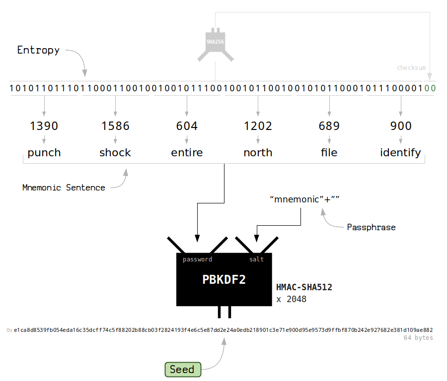
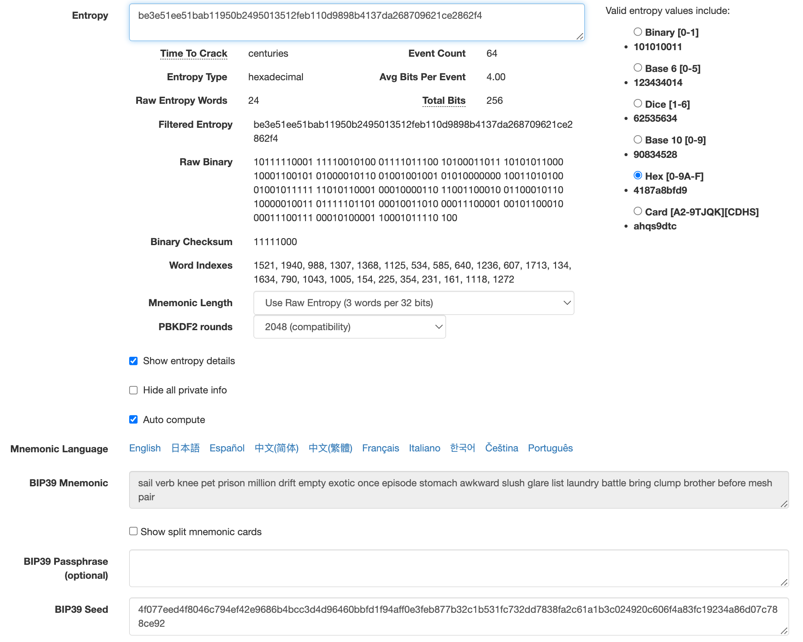
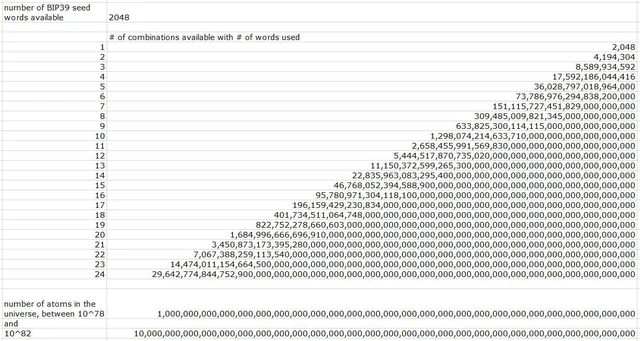

## Bip 39

### Source

 * [ethereum-201-mnemonics](https://wolovim.medium.com/ethereum-201-mnemonics-bb01a9108c38)
 * [mnemonic-to-seed](https://learnmeabitcoin.com/technical/mnemonic#mnemonic-to-seed)

Bip 39 is simply about creating a "seed" from some "entropy". Entropy is the same is the mnemonic phrase, words, or seed phrase. You can either randomly generate entropy using [Secure.random()](https://api.dart.dev/stable/2.17.0/dart-math/Random/Random.secure.html) or you can have one defined by a list of words, 24 in Roqqu wallet's case.

[More on Secure.random()](https://www.scottbrady91.com/dart/generating-a-crypto-random-string-in-dart)

The seed is then created by sending that entropy into the PBKDF2 hash function. That's all Bip 39 is.

 ### Diagram

 ### Dependency

 We use a modified version of [bip39](https://pub.dev/packages/bip39) dart library for this. [github](https://github.com/dart-bitcoin/bip39)

 ### Unit Test

 See `bip39_test.dart`. The data and results generated corresponds to Ian Coleman's website:

### 24-word security

A 24-word recovery phrase gives about the same number of different seed possibilities as number of atoms in the universe. [YouTube video](https://youtu.be/hjRntYh0ot8)

